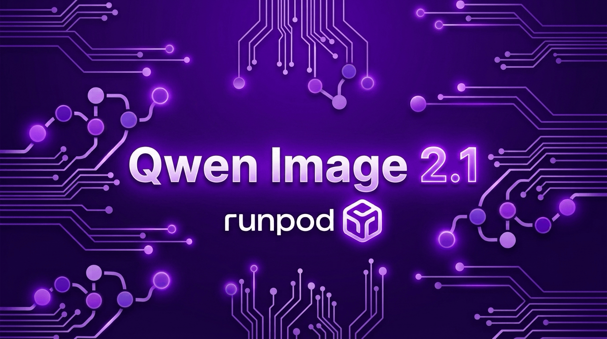
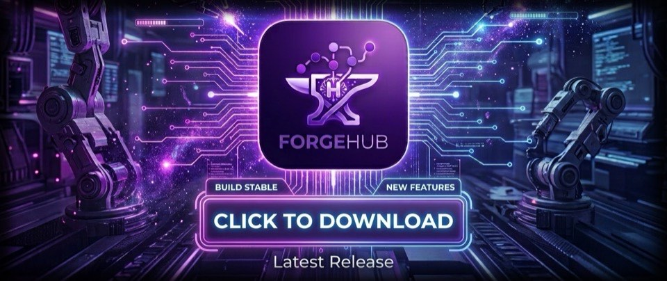

# Qwen Image 2.1 — ComfyUI Serverless Worker

[](https://console.runpod.io/hub)

A production-ready [Runpod Serverless](https://docs.runpod.io/serverless/overview) worker running **Qwen Image 2.1** (official Comfy-Org INT8 ConvRot) on ComfyUI — text-to-image and image editing with wildcard prompt expansion, an uncensored Qwen3-VL prompt enhancer, and Pony/Illustrious checkpoint workflows.

Built for [ForgeHub](https://github.com/huchukato/ForgeHub), a desktop + self-hosted frontend that drives these workflows — but the endpoint speaks plain Runpod API, so anything can call it.

## Workflows included

| Workflow | Description |
| --- | --- |
| `QwenImage21-T2I-Wildcards.json` | Text-to-image, wildcard expansion + QwenVL prompt enhancer, detail LoRA |
| `QwenImageEdit21-Wildcards.json` | Instruction-based image editing (1–2 reference images) |
| `PimpMyPony-TagComplete.json` | Pony/Illustrious txt2img with tag completion |

## Requirements

- **GPU**: 48GB class (`ADA_48_PRO` pool — e.g. RTX 6000 Ada / L40S)
- **Network volume**: ≥60GB attached to the endpoint at `/runpod-volume`. On first boot every worker auto-downloads missing models from `models-manifest.txt` (~45GB — the first cold start takes a while; subsequent workers reuse the volume). Disable with `VOLUME_AUTOPOPULATE=false` if you manage the volume yourself.
- **CUDA**: 12.9+ hosts (image is CUDA 13.0)

## Models (auto-provisioned)

| File | Source |
| --- | --- |
| `qwen_image_2.1_int8_convrot.safetensors` | [Comfy-Org/Qwen-Image-2.1](https://huggingface.co/Comfy-Org/Qwen-Image-2.1) |
| `qwen3-vl-8b-heretic-1.3.0-int8convrot.safetensors` | [craftingmod/Qwen3-VL-8B-Heretic-INT8](https://huggingface.co/craftingmod/Qwen3-VL-8B-Heretic-INT8) |
| `qwen_image_2.1_vae_bf16.safetensors` | [Comfy-Org/Qwen-Image-2.1](https://huggingface.co/Comfy-Org/Qwen-Image-2.1) |
| `elusarcas-qwen2-1-detailer-v1.safetensors` | [reverentelusarca/elusarcas-qwen-2.1-detail-enhancer-lora](https://huggingface.co/reverentelusarca/elusarcas-qwen-2.1-detail-enhancer-lora) |
| `ilustmix_v111.safetensors`, `pimpmypony_pmpInCaseEnhanced.safetensors` | [huchukato/garage](https://huggingface.co/huchukato/garage) |
| `Qwen3.5-9B-…-Q6_K.gguf` + `mmproj-BF16.gguf` | [DavidAU/Qwen3.5-9B-The-Defiant-Fable-…-GGUF](https://huggingface.co/DavidAU/Qwen3.5-9B-The-Defiant-Fable-Uncensored-Heretic-NEO-IMATRIX-MAX-MTP-GGUF) |

## Job input

```json
{
  "input": {
    "workflow": "QwenImage21-T2I-Wildcards.json",
    "prompt": "a __pmp/prmpt/lctns__ street scene, cinematic light",
    "image_size": "1344x768",
    "seed": 12345,
    "images": ["https://… or base64"]
  }
}
```

- `workflow` — file in `/opt/workflows` (see table above), **or** pass `"prompt_graph": {…}` with a full ComfyUI API-format graph (this is what ForgeHub does)
- `prompt` — patched into every `prompt` widget and `WildcardProcessor` node
- `images` — URLs or base64, mapped to `LoadImage` nodes in id order
- `image_size` / `resolution`, `seed`, `params` (`{"node:widget": value}` overrides), `vl_preset`, `enhance`
- `"action": "health"` — returns `{"status": "ok", "workflows": […], "volume_mounted": bool}` without running a generation

## Custom nodes baked in

`ComfyUI-QwenVL-Mod` · `ComfyUI-TagForge` (wildcards) · `ComfyUI-Pixaroma` · `ComfyUI-KJNodes` · `rgthree-comfy`

## Companion stack

- 🎬 Video sibling: [huchukato/runpod-minimax-h3](https://github.com/huchukato/runpod-minimax-h3) (MiniMax H3 Turbo T2VA/I2VA/FL2VA/R2VA)
- 🖥 Frontend: [ForgeHub](https://github.com/huchukato/ForgeHub)

## Get the app

Deployed the endpoint? Drive it with ForgeHub — workflows, wildcard browsing, job queue and outputs included. Paste your API key and it detects the endpoint by itself.

<a href="https://github.com/huchukato/ForgeHub/releases/latest"></a>
